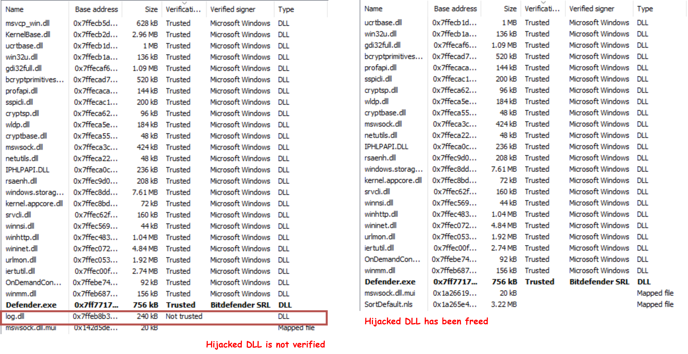

# Trust Me Plz

A Poc of free not-trusted DLL in PE image to evade memory scan.

## Insights

- map malicious code to verified image.
- free hijacked dll before return to new eip/rip
- return to verified image.

## Implement

When hijack loading happend, firstly we run our malicious code with new thread.
Then we craft a shellcode which could free our DLL and sleep the main thread.
Once we inject the shellcode with ROP (to the return address for current stack),
we can free the malicious DLL and let our malicious thread run free.

```
FreeDll -- craft the shellcode to free DLL.
Kasper -- a loader with dll hijack.
```



## Further

The stack of the thread we create to run our shellcode is looks wired.
I will try to improve this using SilentMoonwalk.\
[https://github.com/klezVirus/SilentMoonwalk]
